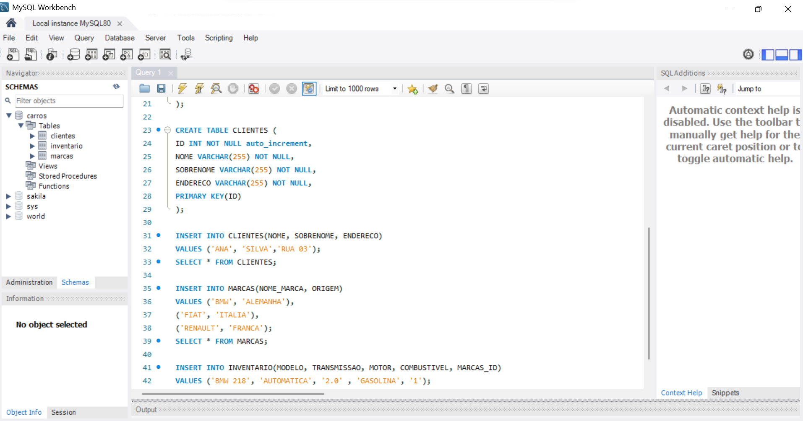

# Desenvolvimento em SQL para Engenheira de Dados

Como parte do meu processo de desenvolvimento profissional, estou investindo em minhas habilidades em SQL, uma competência essencial para minha carreira como engenheira de dados. O curso **MySQL do básico ao avançado** foi escolhido para aprofundar meus conhecimentos práticos e garantir que eu possa lidar com consultas e gerenciamento de bancos de dados de forma eficiente.

## O que aprendi:
- **Consultas SQL**: Desde comandos básicos até consultas avançadas utilizando JOINs, GROUP BY, e funções agregadoras.
- **Manipulação de Dados**: Criação de tabelas, inserção de dados e definição de restrições de integridade.
- **Integração com Python**: Automatização e otimização de consultas SQL em conjunto com scripts em Python.
- **Modelagem de Dados**: Capacidade de modelar dados, criando soluções para problemas de negócios.

## Por que isso é importante para minha carreira?
SQL é uma das habilidades mais requisitadas em minha área e com ele eu consigo:
- **Gerenciar Bancos de Dados**: Interagir com bancos de dados e gerar relatórios para tomadas de decisões baseadas em dados.
- **Desempenho**: Responder a questões relacionadas ao desempenho dos sistemas, utilizando SQL para análises e ajustes.
- **Integração de Sistemas**: Integrar o SQL em diferentes sistemas e processos da empresa, uo que permite otimizar fluxos de dados.

## Impacto no meu desenvolvimento:
Esse curso me ajudou a melhorar as habilidades que utilizo no meu dia a dia, incluindo a consulta de grandes volumes de dados e a automação de processos repetitivos.

## Hands On:

